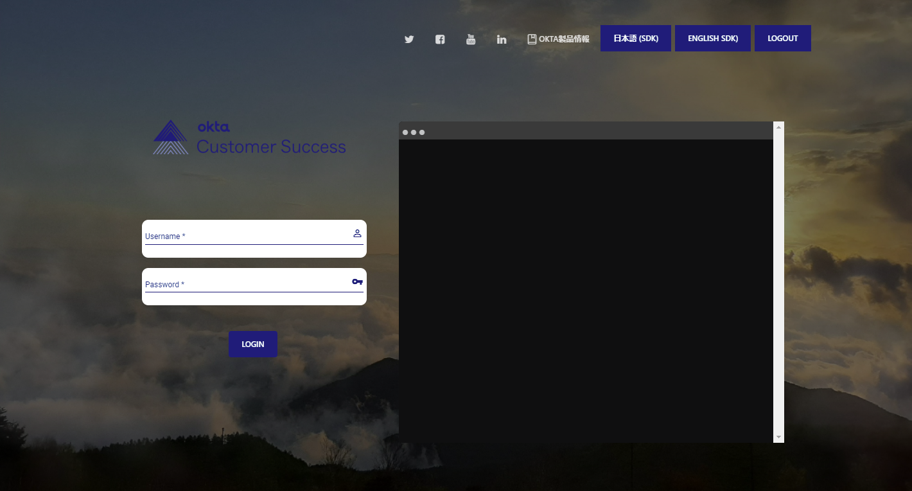
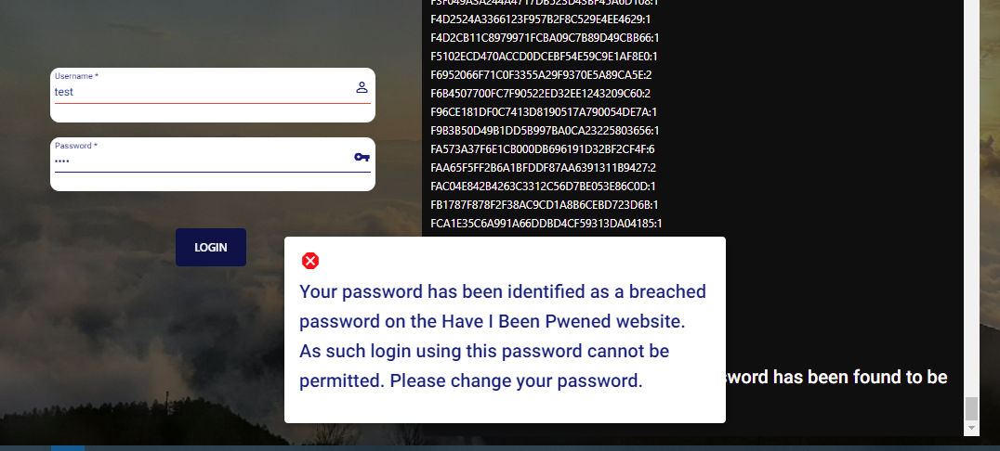
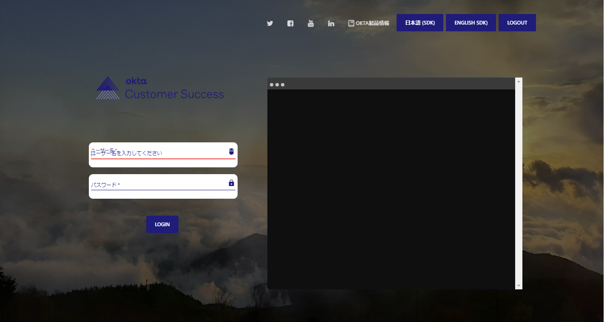
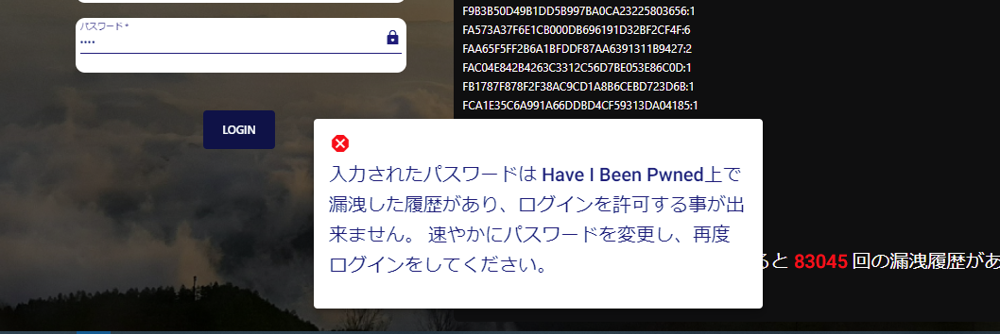

# Okta Custom Login with HIBP Checker version 2

**Please note this is NOT an official Okta tool, and the Okta support team does NOT provide support for this.**
This is merely a personal projct, and Okta's support do not offer support for this tool.

## What does this tool do?
This tool uses [Okta](https://github.com/okta/okta-auth-js)'s Auth JS SDK for the login flow.
Once the password has been entered, and the login button is clicked, the entered password will be checked against [HIBP](https://haveibeenpwned.com/) prior to submitting the information to login.

The entered password will be checked against [HIBP](https://haveibeenpwned.com/) using the API that has been made available to the public.  
More information on the [HIBP](https://haveibeenpwned.com/) API can be found here [https://haveibeenpwned.com/API/v2#PwnedPasswords](https://haveibeenpwned.com/API/v2#PwnedPasswords).

If the endered password has been found to be breached according to [HIBP](https://haveibeenpwned.com/), the user will not be permitted to login.  Only users using passwords not found on the [HIBP](https://haveibeenpwned.com/) website will be permitted to login.

## Screenshots 





## Pre-requisites for running this application
- Nodejs setup with Angluar CLI
- Okta developer account - If you do not have one already, you can sign up for a free trial [here](https://developer.okta.com/signup/).
- Create an OIDC application in the Okta admin console to obtain the below information.
  - Client ID
  - redirect URL (you need to set this)
  - Authorisation server URL
  - Set CORS to allow redirect
  
## Development Environment
```
Angular CLI: 11.2.14
Node: 14.15.0
OS: linux x64

Angular: 11.2.14
... animations, cli, common, compiler, compiler-cli, core, forms
... platform-browser, platform-browser-dynamic, router
Ivy Workspace: Yes

Package                         Version
---------------------------------------------------------
@angular-devkit/architect       0.1102.14
@angular-devkit/build-angular   0.1102.14
@angular-devkit/core            11.2.14
@angular-devkit/schematics      11.2.14
@angular/cdk                    11.2.13
@angular/flex-layout            12.0.0-beta.34
@angular/material               11.2.13
@schematics/angular             11.2.14
@schematics/update              0.1102.14
rxjs                            6.6.7
typescript                      4.1.6

```

 
## How to run this tool
- In a directory of your choice,

`git clone https://github.com/mortpanda/okta-siw-hibp-check.git`
- Enter the directory,

`cd okta-siw-hibp-check`
- Install pakackages

`npm install`
- Run the tool

`ng serve`
- Open the tool

`http://localhost:4200`

- Update the below file with the information from your org,

`src/app/okta-widget.js`

`src/app/shared/okta-auth-service.ts`

`src/app/shared/okta-authenticationEN.ts`

`src/app/shared/okta-authentication.ts`


- Inside the files, the below section will need to be updated with your setting.

```
export class OktaSDKAuthService {
  constructor(){ }
  strRedirectURL = "{{Your redirect URL}}";
  strClientID = "{{Client ID}}";
  strIssuer = "{{Issue URL}}";
  strPostLogoutURL = "{{Your post logout redirect URL}}";
  strScope = ['openid', 'email', 'profile'];
  strResponseType = ['token','id_token'];
  strResponseMode = 'fragment';
  strPkce = false;
  
   
    config = {
        clientId: this.strClientID,
        issuer: this.strIssuer,
        redirectUri: this.strRedirectURL,
        postLogoutRedirectUri:this.strRedirectURL,
        responseMode: this.strResponseMode,
        responseType: this.strResponseType,
        scopes: this.strScope,
    };

    OktaSDKAuthClient = new OktaAuth(this.config);    
}
```
```
var strRedirectUrl = "{{Your redirect URL}}";
var strPostLogoutUrl = "{{Your post logout redirect URL}}";
var strClientID = "{{Client ID}}";
var strIssuer = "{{Issue URL}}";
var strBaseURL = "{{Base URL}}";
```
